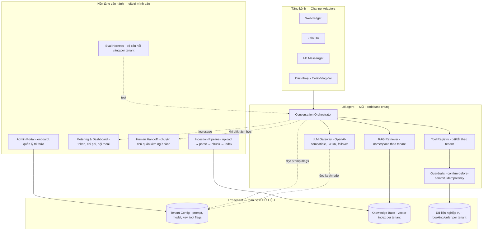

# Kiến trúc nền tảng AI trợ lý đa doanh nghiệp (Multi-tenant AI Assistant Platform)

> Tài liệu thiết kế gốc cho dự án kế tiếp — nâng cấp từ demo "Petal & Polish" (chatbot
> tiệm nail) thành một nền tảng phục vụ nhiều doanh nghiệp vừa và nhỏ (SMB).
>
> **Mô hình kinh doanh:** một lõi AI chung; mỗi doanh nghiệp (tenant) đưa tài liệu
> riêng để bot phục vụ đúng quán của họ; khách tự trả phí token API (BYOK);
> mình là bên vận hành và duy trì.

---

## 1. Mục tiêu & phạm vi

| Mục tiêu | Thước đo thành công |
|---|---|
| Onboard 1 doanh nghiệp mới KHÔNG cần sửa code | Thời gian onboard ≤ 1 buổi, do người vận hành (không phải dev) thực hiện |
| Bot trả lời đúng tri thức riêng từng quán | Bộ eval per-tenant pass ≥ ngưỡng trước khi go-live |
| Khách tự trả token, thấy rõ mình trả cho gì | Dashboard usage/chi phí theo tenant, cập nhật hằng ngày |
| Không bao giờ "ghi bậy" vào dữ liệu nghiệp vụ | Guardrails confirm-before-commit áp cho MỌI tenant, mọi ngành |
| Một sự cố chỉ ảnh hưởng 1 tenant | Cô lập dữ liệu + key + RAG namespace theo tenant |

**Ngoài phạm vi (không làm):** fine-tune model theo từng quán (đắt, lỗi thời nhanh,
khó bảo trì — tri thức riêng đi qua RAG + cấu hình); tự host LLM; xây CRM đầy đủ.

---

## 2. Nguyên tắc thiết kế (bất biến — mọi quyết định phải soi qua đây)

1. **Tenant-config-as-data.** Mọi thứ khác nhau giữa các doanh nghiệp là DỮ LIỆU
   (dòng trong DB), không phải code. Thêm quán mới = thêm bản ghi, không deploy.
2. **Một lõi agent duy nhất.** Chat, voice, Zalo, Messenger… đều đi qua cùng một
   orchestrator và cùng một bộ nghiệp vụ (bài học từ demo: `salon.py` dùng chung
   cho chat + voice là quyết định đúng nhất — nhân rộng nó).
3. **Guardrails ở tầng TOOL, không phải tầng prompt.** Prompt có thể bị model phớt
   lờ; cửa chặn trong code thì không. Luật "model không được nói *đã đặt/đã hủy*
   trừ khi tool trả `ok=true`" là bất biến nền tảng.
4. **Model-agnostic qua lớp OpenAI-compatible.** Không gọi SDK riêng của provider
   trong nghiệp vụ; mọi lời gọi LLM đi qua một gateway để đổi provider/model theo
   tenant mà không sửa code. (Ngoại lệ có kiểm soát: realtime voice — xem §5.6.)
5. **Fail loud, degrade gracefully.** Key tenant hết quota → thông báo chủ quán +
   chuyển câu trả lời mẫu/handoff, KHÔNG chết im trước mặt khách của họ.
6. **Tri thức có vòng đời.** Tài liệu ingest có version, có nguồn gốc, xem lại
   được, xóa được — vì tài liệu SMB đưa luôn thiếu và sai, sửa tri thức là dịch
   vụ thu tiền của mình.

---

## 3. Kiến trúc tổng thể



**Luồng một lượt hội thoại (mọi kênh như nhau):**

```
Tin nhắn khách (kèm tenant_id từ kênh)
  → nạp TenantConfig (prompt template + tool flags + model + key)
  → RAG retrieve trong namespace của tenant
  → dựng context (ngày giờ hiện tại + bảng quy đổi ngày + RAG)
  → LLM Gateway gọi model CỦA TENANT (key của họ), stream/non-stream
  → nếu model gọi tool: Guardrails kiểm cửa → thực thi → lặp (max N vòng)
  → trả lời (plain text) + ghi usage vào Metering + lưu history
```

---

## 4. Mô hình dữ liệu (schema lõi)

### 4.1. Tenant & cấu hình

```
Tenant
  id, slug, name, industry (nail|fnb|clinic|retail|other)
  status (trial|active|suspended)
  timezone, locale_default
  created_at

TenantAIConfig            -- 1-1 với Tenant
  tenant_id (FK)
  system_prompt_template  -- template chung + biến {business_name, tone, rules…}
  custom_rules_text       -- luật riêng chủ quán thêm (được chèn vào template)
  chat_model, chat_model_fallback
  voice_model (nullable — không phải tenant nào cũng bật voice)
  provider (gemini|openai|anthropic|…)
  api_key_encrypted       -- BYOK, mã hóa envelope (xem §7)
  enabled_tools (JSON)    -- ["booking","order","faq","handoff",…]
  enabled_channels (JSON) -- ["web","zalo","messenger","phone"]
  max_tool_rounds, rate_limit_per_session

TenantChannelBinding      -- nối kênh ngoài về tenant
  tenant_id, channel (zalo|messenger|phone|web)
  external_id             -- OA id / page id / số điện thoại / widget key
  credentials_encrypted   -- token webhook của kênh
```

### 4.2. Nghiệp vụ đặt chỗ TỔNG QUÁT (generalized booking)

Nail có *thợ + dịch vụ*; quán ăn có *bàn + khung giờ*; phòng khám có *bác sĩ +
loại khám*. Trừu tượng chung: **Resource + Offering + TimeSlot**.

```
Resource                  -- "ai/cái gì phục vụ": thợ, bàn, bác sĩ, phòng
  tenant_id, name, type_label, capacity (mặc định 1), is_active, work_hours (JSON)

Offering                  -- "dịch vụ gì": làm gel, bàn 4 người, khám tổng quát
  tenant_id, name, price, duration_minutes, description, is_active

Booking
  tenant_id
  customer_name, customer_phone
  offering_id (FK), resource_id (FK, nullable = "Any")
  start_time (datetime, index cùng resource_id)
  status (pending|confirmed|cancelled|completed|no_show)
  source_channel, created_by (ai|human)
  UNIQUE (tenant_id, resource_id, start_time)   -- chặn double-booking Ở TẦNG DB
```

> Kiểm tra trống lịch = so overlap `start_time + duration` như demo, nhưng bọc
> trong `transaction.atomic()` + bắt `IntegrityError` từ unique constraint
> (demo hiện thiếu — race condition đã xác nhận).

Tenant đã có phần mềm riêng (KiotViet, Sapo, Google Calendar…) → không nhét vào
schema này; viết **Integration Adapter** đọc/ghi hệ của họ, tool của bot gọi qua
adapter. Cùng interface `check_availability / create_booking / cancel_booking`.

### 4.3. Tri thức (RAG)

```
KnowledgeSource           -- một tài liệu gốc chủ quán đưa
  tenant_id, title, source_type (pdf|docx|image|url|sheet|manual_text)
  original_file_ref, status (processing|indexed|failed|archived)
  version, uploaded_by, uploaded_at

KnowledgeChunk            -- metadata; vector nằm trong vector store
  source_id (FK), chunk_index, text, token_count
  vector_ref               -- id trong pgvector/Chroma collection của tenant
```

Vector store: **mỗi tenant một collection/namespace riêng** — cô lập tuyệt đối,
xóa tenant = drop collection. Embedding chạy **local** (ONNX MiniLM như demo):
miễn phí, không quota, không phụ thuộc key của tenant.

### 4.4. Hội thoại & đo đếm

```
Conversation
  tenant_id, channel, external_user_ref (cookie/zalo uid/số ĐT)
  started_at, last_active_at, handed_off (bool)

Message                   -- lưu CẢ tool_calls + tool_results (hộp đen debug)
  conversation_id, role (user|assistant|tool), content (JSON), created_at

UsageRecord               -- mỗi lời gọi LLM một dòng
  tenant_id, conversation_id, model, input_tokens, output_tokens
  latency_ms, was_fallback (bool), cost_estimate, created_at
```

> Bài học demo: bảng session chứa `chat_messages` là công cụ tìm mọi bug "bot nói
> dối". Nền tảng phải giữ hộp đen này thành bảng chính thức, có UI xem lại.

---

## 5. Các thành phần chi tiết

### 5.1. Channel Adapters (tầng kênh)

Mỗi kênh là một adapter mỏng, chuẩn hóa về một interface duy nhất:

```
IncomingMessage { tenant_id, conversation_key, text|audio, channel, metadata }
OutgoingMessage { text|audio, quick_replies?, handoff_signal? }
```

- **Web widget**: script nhúng, nhận `widget_key` → map ra tenant. SSE streaming.
- **Zalo OA / FB Messenger**: webhook receiver; map OA/page id → tenant qua
  `TenantChannelBinding`. Đây là kênh QUAN TRỌNG NHẤT với SMB Việt Nam — ưu tiên
  trước cả voice.
- **Điện thoại**: Twilio Media Stream (hoặc tổng đài nội địa có SIP) ⇄ realtime
  voice model. Mỗi số điện thoại inbound map về một tenant.
- Adapter KHÔNG chứa nghiệp vụ. Nó chỉ dịch định dạng và xác định tenant.

### 5.2. Conversation Orchestrator (tim của hệ thống)

Chính là `Chatbot.ask/ask_stream` của demo, tổng quát hóa:

- Nạp `TenantAIConfig` mỗi request (prompt luôn tươi — demo đã làm đúng: thay
  system prompt mới vào history mỗi lượt, giữ cơ chế này).
- Dựng context: ngày giờ theo `tenant.timezone` + bảng quy đổi 8 ngày tới + RAG.
- Vòng lặp tool tối đa `max_tool_rounds`; cắt history tại ranh giới lượt `user`
  (không tách cặp tool_call ↔ tool_result — bẫy đã biết).
- Trả lời plain text (giữ 2 lớp: luật trong prompt + bộ lọc `_to_plain_text`).
- Mirror ngôn ngữ khách: mô tả tool + giá trị tool trả về viết TIẾNG ANH.

### 5.3. LLM Gateway (điểm mấu chốt cho BYOK)

Một lớp duy nhất mọi lời gọi LLM đi qua. Hai phương án:

| Phương án | Ưu | Nhược | Khuyên dùng |
|---|---|---|---|
| **Tự viết** (mở rộng `_create_with_retry` của demo) | Nhẹ, kiểm soát hết | Tự lo metering, retry, multi-provider | MVP |
| **LiteLLM proxy** (self-host) | Có sẵn BYOK per-key, usage tracking, failover, budget alert, 100+ providers | Thêm 1 tiến trình phải vận hành | Từ ~10 tenant trở lên |

Trách nhiệm của gateway (dù chọn phương án nào):

1. Giải mã key của tenant, gọi đúng provider/model của tenant.
2. Retry + failover model dự phòng (bài học 503: spike bám theo TỪNG model,
   đổi model là thoát — cấu hình `chat_model_fallback` per tenant).
3. Ghi `UsageRecord` cho MỌI lời gọi (kể cả thất bại).
4. Khi key tenant hết quota/bị khóa: bắn cảnh báo cho chủ quán (Zalo/Telegram)
   + cho mình; bot chuyển chế độ trả lời tĩnh + đề nghị để lại số điện thoại.
5. Circuit breaker per tenant — một tenant bị spam không kéo sập tiến trình chung.

### 5.4. Tool Registry & Guardrails

- Tool khai báo MỘT NƠI (schema + handler + mô tả tiếng Anh), đăng ký vào
  registry; orchestrator lọc theo `enabled_tools` của tenant. Hết cảnh "thêm tool
  phải sửa 3 file" của demo.
- Bộ tool lõi: `list_offerings`, `check_availability`, `find_bookings`,
  `create_booking`, `update_booking`, `cancel_booking`, `search_knowledge`,
  `request_human` (handoff).
- Guardrails là decorator/lớp bọc quanh handler ghi-dữ-liệu, tái sử dụng nguyên
  máy trạng thái của demo:
  - thiếu trường → `need_more_info`
  - chưa xác nhận → `needs_confirmation` (tóm tắt để khách gật)
  - trùng khách + giờ → `already_booked` (idempotent — gật 2 lần vẫn 1 booking)
  - trùng giờ khác nội dung → `use_update_instead`
  - tài nguyên kín giờ → `resource_busy`
  - chỉ khi `customer_confirmed=true` và qua hết cửa → ghi DB (trong transaction)
    + notify chủ quán.

### 5.5. Ingestion Pipeline (biến `manage.py ingest` thành sản phẩm)

```
Upload (PDF/DOCX/ảnh menu/URL/Sheet/text)
  → hàng đợi (job async — KHÔNG chặn request)
  → Parse: pdfplumber/docx; ảnh menu → LLM vision trích cấu trúc; URL → crawl
  → Làm sạch + chunk (theo heading/semantic, 300–800 token, overlap nhỏ)
  → Embed local (ONNX) → upsert vào collection của tenant
  → Cập nhật KnowledgeSource.status; version++ nếu là bản thay thế
  → TỰ ĐỘNG chạy eval smoke (5–10 câu) → báo kết quả cho người vận hành
```

- **Admin UI tri thức**: chủ quán/người vận hành xem danh sách nguồn, preview
  chunk, sửa/xóa từng nguồn, thấy "bot đang biết gì". Vòng lặp sửa tri thức là
  dịch vụ duy trì mình thu tiền.
- Tài liệu cấu trúc (bảng giá, menu) → ưu tiên trích thành **dữ liệu có cấu trúc**
  (bảng `Offering`) thay vì chỉ nhét vào RAG — giá cả trả lời từ DB qua tool luôn
  chính xác hơn RAG.

### 5.6. Voice (realtime)

- Kênh voice dùng realtime API của provider (Gemini Live / OpenAI Realtime).
  Đây là chỗ DUY NHẤT chấp nhận gọi SDK riêng — cô lập trong adapter voice.
- Bài học demo phải mang theo: dùng dòng model "live" ổn định với tool (không
  ham dòng native-audio giọng hay nhưng tool sập); phiên chết giữa chừng → adapter
  tự đóng WebSocket; FE phải xử lý tín hiệu `interrupt` (khách chen ngang).
- Voice là tính năng NÂNG CAO, bật per tenant, làm SAU chat/Zalo — chi phí và độ
  phức tạp cao hơn nhiều, trong khi SMB cần nhắn tin trước.

### 5.7. Eval Harness (bảo hiểm khi scale)

- Mỗi tenant có **bộ câu hỏi vàng**: hỏi giá, giờ mở cửa, đặt chỗ đủ luồng
  (thiếu thông tin → hỏi lại → xác nhận → kiểm DB có row), câu bẫy ngoài phạm vi
  (bot phải từ chối lịch sự), câu đổi ngôn ngữ.
- Chấm bằng: assertion cứng cho tool-flow (DB có/không có row, tool nào được gọi)
  + LLM-as-judge cho chất lượng câu trả lời (dùng model rẻ).
- Chạy khi: (a) đổi prompt template chung, (b) đổi model, (c) tenant cập nhật
  tri thức, (d) định kỳ hằng đêm. Kết quả đỏ → chặn rollout + báo người vận hành.
- Test nghiệp vụ thuần (guardrails) không tốn token — gọi thẳng handler như demo
  test qua `manage.py shell`. Viết thành unit test chạy CI.

### 5.8. Metering, Dashboard & Handoff

- **Dashboard chủ quán**: số hội thoại, booking bot tự chốt, token đã dùng + ước
  tính tiền, các câu bot không trả lời được (mỏ vàng để bổ sung tri thức).
- **Dashboard vận hành (mình)**: sức khỏe mọi tenant một màn hình — error rate,
  latency, tỉ lệ fallback model, tenant nào key sắp hết quota.
- **Human handoff**: tool `request_human` → notify chủ quán (Zalo/Telegram) kèm
  tóm tắt hội thoại + link xem full; bot báo khách "em đã chuyển cho anh/chị chủ".
  Trigger: khách yêu cầu, bot bí 2 lượt liên tiếp, sentiment tiêu cực, hoặc chạm
  nghiệp vụ ngoài phạm vi tool.
- **Alerting cho mình**: Sentry (exception) + cảnh báo ngưỡng (error rate, chi
  phí bất thường/loop tool, key chết).

---

## 6. Tech stack đề xuất

| Lớp | Chọn | Lý do |
|---|---|---|
| Backend | **Django + Django Channels** (như demo) | Đã thuộc; admin có sẵn cho vận hành; ORM + migration tốt cho multi-tenant |
| DB | **PostgreSQL** (thay SQLite) | Nhiều writer đồng thời, unique constraint + transaction tin cậy, row-level scoping theo tenant |
| Vector | **pgvector** (extension của chính Postgres) | Một DB duy nhất: backup/restore/cô lập tenant một chỗ; đỡ vận hành Chroma riêng. (Chroma vẫn ổn cho MVP) |
| Cache + Channel layer | **Redis** | Channels cần cho multi-process; kiêm rate-limit counter |
| Job queue | **Celery** (hoặc Django-tasks) + Redis | Ingestion, eval, notify chạy nền — không chặn hội thoại |
| LLM Gateway | Tự viết (MVP) → **LiteLLM proxy** (scale) | Xem §5.3 |
| Embedding | **ONNX all-MiniLM local** (giữ nguyên demo) | Miễn phí, không quota, không chết theo key tenant |
| FE widget + portal | React + Vite (như demo) | Widget nhúng + admin portal dùng chung stack |
| Deploy | Docker Compose: web (daphne) + worker + Postgres + Redis | 1 VPS chạy được vài chục tenant; scale ngang sau |
| Multi-tenancy | **Shared schema + cột `tenant_id`** (KHÔNG schema-per-tenant) | Đơn giản nhất, đủ cho SMB; kỷ luật: mọi query qua manager tự lọc tenant |

> Nguyên tắc chuyển đổi: SQLite → Postgres và Chroma → pgvector là "thay nền" —
> làm khi bắt đầu dự án mới luôn (rẻ nhất lúc chưa có dữ liệu), nhưng đừng để nó
> trì hoãn phần ăn điểm chính là tenant-config và ingestion.

---

## 7. Bảo mật & cô lập

1. **Key của tenant (BYOK)**: mã hóa envelope — key dữ liệu mã hóa bằng master
   key nằm ngoài DB (biến môi trường/KMS). Không bao giờ log key, không trả key
   về FE, chỉ giải mã trong LLM Gateway. Có luồng "kiểm tra key" khi onboard
   (bắn 1 request thật — bài học: danh sách models không đáng tin, key mới không
   gọi được model đời cũ).
2. **Cô lập tenant**: mọi query nghiệp vụ đi qua custom manager bắt buộc
   `tenant_id`; vector store tách collection; file upload tách thư mục/bucket
   theo tenant; conversation key có scope tenant.
3. **Chống abuse endpoint công khai** (lỗ hổng đã xác nhận trong demo):
   - `/api/chat`: rate limit theo IP + session (Redis), giới hạn độ dài input,
     budget lượt/ngày per tenant (chủ quán đặt trần).
   - Endpoint gọi điện ĐI (`/api/call` kiểu demo): nguy hiểm nhất — chỉ cho gọi
     số đã xuất hiện trong hội thoại đã xác minh, quota chặt/ngày, log đầy đủ.
   - Webhook Zalo/Messenger: verify chữ ký của platform.
4. **Prompt injection qua tài liệu**: tài liệu ingest là DATA — system prompt
   phải dặn model không nghe "lệnh" nằm trong ngữ cảnh RAG; tool ghi dữ liệu đã
   có guardrails code nên thiệt hại bị chặn ở tầng tool.
5. **PII**: số điện thoại khách là PII — mã hóa at-rest mức DB/disk, không đưa
   vào log thường, có luồng xóa dữ liệu khi tenant rời đi (drop collection +
   xóa row theo tenant_id là xong — lợi ích của thiết kế cô lập).

---

## 8. Roadmap thực thi (theo giá trị, không theo độ khó)

### Giai đoạn 0 — Nền móng (tuần 1–2)
- Repo mới: Django + Postgres + Redis + Docker Compose.
- Schema §4 (Tenant, AIConfig, Resource/Offering/Booking, Conversation/Message,
  UsageRecord) + custom manager lọc tenant.
- Port lõi orchestrator + guardrails từ demo, tổng quát hóa tên miền nghiệp vụ
  (technician→resource, service→offering). Unit test guardrails (không tốn token).

### Giai đoạn 1 — MVP nền tảng (tuần 3–6) ← *phần "max điểm"*
- LLM Gateway tự viết: BYOK giải mã, retry/failover, ghi UsageRecord.
- Ingestion pipeline v1: upload PDF/text/URL → parse → chunk → index (Celery),
  admin UI xem/xóa nguồn (Django admin custom là đủ).
- Web widget generic (nhận `widget_key`).
- Onboard lại tiệm nail làm **tenant số 0** qua đúng luồng form + upload —
  KHÔNG sửa code. Đây là bài test kiến trúc quan trọng nhất: nếu onboard tenant 0
  còn phải sửa code thì thiết kế sai, dừng lại sửa thiết kế.
- Onboard 1 tenant ngành KHÁC (quán ăn/cafe) để ép schema tổng quát lộ lỗi sớm.

### Giai đoạn 2 — Kênh thật + tin cậy (tuần 7–10)
- Zalo OA + Messenger adapter (ưu tiên trước voice).
- Eval harness: bộ câu hỏi vàng per tenant + chạy tự động sau ingest/đổi prompt.
- Human handoff + notify chủ quán; dashboard usage v1 cho chủ quán.
- Rate limit + alerting + Sentry.

### Giai đoạn 3 — Mở rộng (tuần 11+)
- Voice per tenant (port `consumers.py`/`twilio_consumer.py`, cô lập adapter).
- LiteLLM proxy thay gateway tự viết khi tenant đông.
- Integration adapter đầu tiên (Google Calendar hoặc KiotViet).
- Billing dịch vụ duy trì của MÌNH (tách bạch với token khách tự trả).

---

## 9. Bài học từ demo phải mang theo (đã đổ máu, đừng học lại)

1. Verify qua ĐÚNG đường UI dùng (streaming + cookie session), không tin đường JSON.
2. ASGI gom iterator đồng bộ — stream phải bọc async iterator; session phải
   `create()` trước khi trả streaming response.
3. Streaming + function calling: tách slot tool call theo id/name (không theo
   index); lưới an toàn câu-cụt-nuốt-tool; giữ mọi trường lạ của provider
   (vd `thought_signature`) khi trả lại.
4. 503 bám theo từng model — failover ĐỔI MODEL, không chỉ retry.
5. Đổi model phải test bằng key thật, không tin danh sách `/models`.
6. Voice: dòng "live" ổn định tool > dòng "native-audio" giọng hay; phiên chết
   phải tự đóng WS; FE xử lý `interrupt`.
7. Debug bot = đọc hộp đen tool_calls/tool_results trong history, không nghe bot kể.
8. Console Windows cp1252 — ép UTF-8 nếu dev trên Windows.
9. Test nghiệp vụ thuần không tốn token — guardrails là logic thuần, unit test hết.

---

## 10. Checklist onboard một tenant mới (mục tiêu: ≤ 1 buổi, không cần dev)

- [ ] Tạo Tenant + điền business profile (tên, ngành, giờ mở cửa, timezone).
- [ ] Nhập API key của khách → hệ thống bắn 1 request thật để verify key + model.
- [ ] Chọn tool bật (booking? order? chỉ FAQ?), kênh bật, giọng điệu + luật riêng.
- [ ] Khai Resource (thợ/bàn/bác sĩ…) + Offering (dịch vụ, giá, thời lượng).
- [ ] Upload tài liệu (bảng giá, nội quy, FAQ…) → chờ index xong → duyệt preview.
- [ ] Chạy bộ eval smoke → pass ngưỡng.
- [ ] Nhúng widget / kết nối Zalo OA / trỏ số điện thoại.
- [ ] Đặt thử 1 booking thật đầu-cuối → thấy row trong DB + chủ quán nhận notify.
- [ ] Bật trần chi phí/ngày + kênh nhận cảnh báo của chủ quán.
- [ ] Go-live; hẹn review sau 1 tuần (đọc các câu bot bí → bổ sung tri thức).

---

*Tài liệu này là bản thiết kế gốc — khi bắt đầu dự án mới, copy file này vào repo
mới làm `ARCHITECTURE.md`, và cập nhật nó mỗi khi quyết định kiến trúc thay đổi.*
